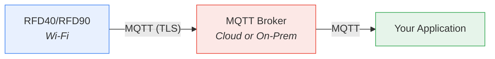
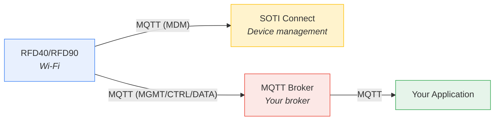
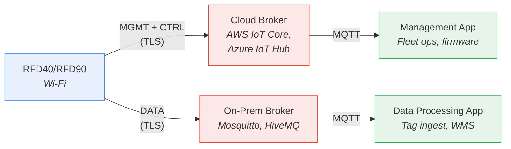

# Architecture Overview

Zebra RFID Connect is a four-component system. A handheld RFID reader captures tag data over radio frequency, an on-device software agent translates that data into MQTT messages, a broker routes those messages, and your application consumes them. This chapter explains each component, how data flows between them, how the components can be arranged for different deployment scenarios, and why the MQTT interface is split into four distinct channels.

Understanding this architecture before writing code prevents a class of integration mistakes, subscribing to the wrong topic, misunderstanding which component owns which responsibility, or designing a deployment topology that creates unnecessary latency or single points of failure.

---

## 2.1 System Components

The system has four components. Each owns a strict boundary of responsibility.

### Reader Hardware

| Element | Role |
|---------|------|
| **UHF RFID radio** | Transmits RF energy (860–960 MHz) and decodes backscattered signals from EPC Gen2 tags. Configurable transmit power (0–34 dBm depending on model and region), link profiles, sessions, and anti-collision parameters. |
| **Antenna** | Directs and receives RF energy. Internal to the sled housing. Polarization and gain characteristics are fixed per model (RFD9090 long-range variant has a higher-gain antenna than the RFD9030 standard-range). |
| **Bluetooth 5.3** | Connects the reader sled to a host mobile device (phone or tablet). The host device is required for Bluetooth pairing and initial setup. Supports NFC tap-to-pair. |
| **Wi-Fi 6 (802.11ax)** | The reader's primary network interface for MQTT communication. Supports WPA2/WPA3 Personal and Enterprise, including EAP-TLS with mutual certificate authentication. 5 GHz and 2.4 GHz bands. |
| **Battery** | PowerPrecision+ 7000 mAh Li-Ion. Provides 8–12 hours of typical operation. Battery status, charge level, and state-of-health are reported via `get_status` and `heartBeatEVT`. |

The reader is a **sled** : it attaches to a host mobile device (typically a Zebra handheld computer or a compatible smartphone) via Bluetooth. The sled contains all RFID and wireless networking hardware. The host device provides the user interface and, optionally, a secondary network path. For MQTT communication, the reader uses its own **Wi-Fi radio** to connect directly to the network; the host device's network connection is not used for MQTT traffic.

> **Why Wi-Fi and not the host's network?** The reader maintains its own independent MQTT connection over Wi-Fi so that it can continue operating even if the Bluetooth link to the host device drops temporarily. This prevents a momentary Bluetooth disconnection from severing the cloud connection and losing in-flight tag data.

### IoT Connector Agent

The **IoT Connector agent** is firmware running on the reader's application processor. It serves as the translation layer between the MQTT protocol and the reader's internal hardware APIs.

**Responsibilities:**

- **Command execution**: Receives JSON commands from MQTT topics, validates them, and invokes the corresponding hardware operations (start inventory, change Wi-Fi, install certificate, reboot).
- **Response generation**: Constructs JSON response payloads with result codes and requested data, then publishes them to the response topic.
- **Event emission**: Monitors device state and publishes events (heartbeats, alerts, exceptions, connection changes) to event topics without requiring an inbound command.
- **Tag data streaming**: Collects tag reads from the radio during active inventory, assembles them into `dataEVT` payloads, and publishes them to data topics.
- **Connection management**: Maintains MQTT broker connections, handles reconnection on network interruption, and manages TLS handshakes.
- **Configuration persistence**: Stores Wi-Fi profiles, MQTT endpoint configurations, certificates, and event settings in non-volatile memory across reboots.

The agent exposes **no local API**. All interaction with the reader occurs through MQTT. This is a deliberate architectural constraint: by forcing all communication through a single protocol, the system eliminates the need for direct network access to the reader, simplifies firewall rules, and guarantees that every operation is auditable at the broker.

### MQTT Broker

The broker is the message routing infrastructure between your application and the reader fleet. Zebra RFID Connect does not include or require a specific broker, any **MQTT 3.1.1-compliant broker** works.

**Tested and compatible brokers include:**

- **Cloud-managed**: AWS IoT Core, Azure IoT Hub, HiveMQ Cloud
- **Self-hosted**: Eclipse Mosquitto, HiveMQ, EMQX, VerneMQ

**What the broker provides:**

- **Topic-based routing**: Commands published to `{tenantId}/{interface}/clients/cmnd/{serial}` reach the correct reader. Responses published by the reader reach the subscribing application. No point-to-point connections required.
- **QoS guarantees**: QoS 1 (at-least-once) for commands, responses, and events ensures delivery. QoS 0 is available for high-throughput tag data where occasional loss is acceptable.
- **Retained messages**: The `rfid` channel uses MQTT retain to provide the most recent tag data to late-subscribing clients.
- **Fleet-scale fan-out**: Wildcard subscriptions (`zebra/MGMT/clients/resp/+`) allow a single application instance to receive responses from every reader in the fleet.
- **TLS termination**: Production deployments use TLS (port 8883) between the reader and broker, and between the application and broker.

> **The broker is yours.** Zebra does not operate a hosted broker service for RFID Connect. You provision your own broker, which means you control data residency, retention policy, access control, and scaling. The `config_endpoint` command on the reader points it at your broker.

### Cloud Application (Your Code)

Your application is any software that acts as an MQTT client, publishing commands and subscribing to responses, events, and tag data. It runs wherever you choose: a cloud VM, a serverless function, a Kubernetes pod, an on-premises server, or even a local development machine.

**Typical application responsibilities:**

- Publish commands (JSON) to the reader's command topic
- Subscribe to response, event, and data topics
- Correlate responses to commands using `requestId`
- Process tag data (deduplication, database writes, business logic)
- Monitor fleet health via heartbeat and alert events
- Manage reader lifecycle (provisioning, firmware updates, configuration)

The API is **language-agnostic**. Any MQTT client library in any language works: Python (`paho-mqtt`), Node.js (`mqtt.js`), Java (`Eclipse Paho`), C# (`MQTTnet`), Go (`Eclipse Paho`), Rust (`rumqttc`). The only requirements are MQTT 3.1.1 support and JSON serialization.

---

## 2.2 Data Flow: Tag to Cloud

The following diagram traces a single RFID tag read from the physical tag through every system component to your application.

### Mermaid Diagram

```mermaid
flowchart LR
    subgraph Physical["Physical Layer"]
        TAG["🏷️ RFID Tag<br/><i>Backscatters EPC</i>"]
    end

    subgraph Reader["Zebra RFD40 / RFD90"]
        RADIO["📡 UHF Radio<br/><i>860–960 MHz</i>"]
        AGENT["⚙️ IoT Connector<br/>Agent<br/><i>Command execution<br/>JSON serialization</i>"]
        WIFI["📶 Wi-Fi 6<br/><i>802.11ax</i>"]
    end

    subgraph Network["Network Layer"]
        BROKER["🔀 MQTT Broker<br/><i>QoS 0/1 routing<br/>Topic-based fan-out</i>"]
    end

    subgraph Application["Your Infrastructure"]
        APP["💻 Your Application<br/><i>MQTT subscriber<br/>Business logic</i>"]
    end

    TAG -- "RF backscatter" --> RADIO
    RADIO -- "Decoded tag data<br/>(EPC, RSSI, phase)" --> AGENT
    AGENT -- "JSON over MQTT<br/>dataEVT publish" --> WIFI
    WIFI -- "TLS / TCP" --> BROKER
    BROKER -- "Topic subscription<br/>delivery" --> APP

    APP -. "Commands<br/>(JSON over MQTT)" .-> BROKER
    BROKER -. "Command delivery" .-> WIFI
    WIFI -. "Inbound command" .-> AGENT

    style TAG fill:#f9f4e8,stroke:#c9a227,color:#333
    style RADIO fill:#e8f0fe,stroke:#4285f4,color:#333
    style AGENT fill:#e8f0fe,stroke:#4285f4,color:#333
    style WIFI fill:#e8f0fe,stroke:#4285f4,color:#333
    style BROKER fill:#fce8e6,stroke:#ea4335,color:#333
    style APP fill:#e6f4ea,stroke:#34a853,color:#333
```



### Data Flow Step by Step

| Step | From | To | What Happens |
|------|------|----|-------------|
| **1** | RFID tag | UHF radio | The radio transmits an RF interrogation signal. The tag draws energy from the signal and backscatters its EPC and optional memory bank data. |
| **2** | UHF radio | IoT Connector agent | The radio decodes the backscattered signal into structured data: EPC, TID, RSSI, phase angle, channel, read count, and timestamps. |
| **3** | IoT Connector agent | MQTT (via Wi-Fi) | The agent assembles the tag data into a `dataEVT` JSON payload and publishes it to the `data1event` (or `data2event`) topic over the Wi-Fi connection. |
| **4** | Wi-Fi | MQTT broker | The MQTT message traverses the IP network (TLS-encrypted in production) to the broker. |
| **5** | MQTT broker | Your application | The broker delivers the message to all clients subscribed to the matching topic. Your application receives the `dataEVT` payload. |

**Return path (commands):** Your application publishes a JSON command to the `cmnd` topic. The broker routes it to the reader. The IoT Connector agent executes the command and publishes a response on the `resp` topic. The broker delivers the response back to your application.

> **Latency profile:** Under typical conditions (Wi-Fi, QoS 1, broker in the same region), end-to-end latency from tag read to application delivery is **50–200 ms**. The dominant factor is network round-trip time to the broker, not radio or agent processing time.

---

## 2.3 Deployment Topologies

The four system components can be arranged in three deployment patterns. The right choice depends on your network constraints, security requirements, and whether you use a mobile device management platform.

### Direct MQTT

The simplest topology. The reader connects directly to your MQTT broker. Your application subscribes to the same broker. No intermediary.



| Aspect | Detail |
|--------|--------|
| **When to use** | Greenfield deployments without an existing MDM platform; development and testing; single-site installations. |
| **Endpoint configuration** | One endpoint per interface (MGMT, CTRL, DATA), all pointing to the same broker. Configure via `config_endpoint`. |
| **Advantages** | Simplest to set up. Lowest latency. Full control over broker configuration. |
| **Trade-offs** | No centralized device management UI. Provisioning and firmware updates are your responsibility via MQTT commands. |

### MDM-Managed

The reader connects to a **SOTI Connect** server (or compatible MDM platform) in addition to your application's MQTT broker. SOTI handles device enrollment, policy enforcement, and fleet visibility. Your application handles RFID data and operations.



| Aspect | Detail |
|--------|--------|
| **When to use** | Multi-site enterprise deployments with existing MDM infrastructure; when IT requires centralized device policy enforcement. |
| **Endpoint configuration** | Separate MDM endpoint for SOTI. MGMT/CTRL/DATA endpoints point to your broker. The reader maintains concurrent connections to both. |
| **Advantages** | Centralized device enrollment, policy management, and compliance reporting. `alert_short` events deliver simplified alerts optimized for the SOTI console. |
| **Trade-offs** | Additional infrastructure (SOTI server). Reader maintains two concurrent MQTT connections, increasing Wi-Fi and battery load. |

### Hybrid

Management and control traffic routes to a **cloud broker** for remote fleet operations, while high-throughput **tag data routes to an on-premises broker** to minimize latency and keep data local.



| Aspect | Detail |
|--------|--------|
| **When to use** | Deployments with data residency requirements, high tag-data volume, or regulations that prohibit sending operational data to the cloud. |
| **Endpoint configuration** | MGMT and CTRL endpoints point to the cloud broker. DATA endpoint points to the on-premises broker. Each interface has an independent endpoint configured via `config_endpoint`. |
| **Advantages** | Tag data stays on-site (compliance). Management commands traverse the internet, keeping remote fleet control possible. Decouples data-plane throughput from control-plane availability. |
| **Trade-offs** | Two brokers to operate and secure. Network configuration is more complex (split firewall rules, separate TLS certificates). |

> **Why the architecture supports split endpoints:** Each MQTT interface (MGMT, CTRL, DATA, MDM) is configured as an independent endpoint via `config_endpoint`. The reader maintains separate MQTT connections per endpoint. This per-interface endpoint model is the reason the hybrid topology is possible without any special infrastructure; you configure it entirely through the API.

---

## 2.4 Interfaces and Their Roles

The Zebra RFID Connect API separates communication into four **MQTT interfaces**. Each interface serves a distinct concern, uses its own topic namespace, and can be routed to a different broker.

### Why Four Interfaces?

A single MQTT topic namespace could carry all traffic types; commands, responses, events, and tag data, but this would create three problems:

1. **Throughput coupling.** A high-volume `dataEVT` stream during active inventory would share a connection with low-frequency management commands. If the data channel saturates the connection, management commands (firmware update, reboot) could be delayed or dropped.
2. **Security granularity.** An application that only needs tag data should not require broker permissions to send device management commands. Separate interfaces enable per-interface ACLs at the broker.
3. **Deployment flexibility.** The hybrid topology described in Section 2.3 requires routing data to one broker and management to another. Separate interfaces make this a configuration change, not an architecture change.

### Interface Reference

| Interface | Full Name | Direction | Purpose | Topic Channels |
|-----------|-----------|-----------|---------|----------------|
| **MGMT** | Management | Bidirectional | Device lifecycle: status queries, configuration, network settings, certificates, event configuration, firmware updates, reboot | `cmnd`, `resp`, `event` |
| **CTRL** | Control | Bidirectional | RFID operations: start/stop inventory, operating mode configuration, post-filter management | `cmnd`, `resp` |
| **DATA** | Tag Data | Device → Cloud | High-throughput tag data streaming during active RFID operations | `data1event`, `data2event` |
| **MDM** | Mobile Device Management | Bidirectional | Integration with MDM platforms (SOTI Connect). Device enrollment, policy enforcement, simplified alerts | `cmnd`, `resp` |

### MGMT: Device Lifecycle and Fleet Management

**19 commands** | Channels: `cmnd`, `resp`, `event`

The MGMT interface carries all commands that manage the device itself; everything that is not an active RFID operation. This includes querying device identity (`get_version`, `get_status`, `get_current_region`), configuring network connectivity (`set_wifi`, `config_endpoint`), managing security certificates (`install_certificate`), controlling events (`config_events`), updating firmware (`set_os`), and rebooting (`reboot`).

MGMT also carries the **event channel**; the outbound topic where the reader publishes asynchronous events: `heartBeatEVT`, `alerts`, `alert_short`, `exceptionEVT`, and `mqttConnEVT`. These events fire without a preceding command and are essential for monitoring fleet health.

**Topic pattern:**
```
{tenantId}/MGMT/clients/cmnd/{deviceSerial}     ← Commands (your app publishes)
{tenantId}/MGMT/clients/resp/{deviceSerial}      ← Responses (reader publishes)
{tenantId}/MGMT/clients/event/{deviceSerial}     ← Events (reader publishes)
```

**Typical usage pattern:** Provision a new reader by configuring Wi-Fi → endpoint → certificate → event thresholds, all over MGMT. Then monitor it via heartbeat and alert subscriptions on the event channel.

### CTRL: Real-Time RFID Operation Control

**5 commands** | Channels: `cmnd`, `resp`

The CTRL interface governs active RFID operations. It controls *what the radio does right now*: starting and stopping inventory scans (`control_operation`), configuring how the radio operates (`set_operating_mode`; profiles, transmit power, link profiles, select filters, access operations), and filtering tag data at the source (`set_post_filter`).

CTRL is separated from MGMT because RFID operations are **real-time and latency-sensitive**. A `control_operation` START command must reach the reader without queuing behind a bulk configuration upload on the MGMT connection. The separate connection guarantees that operational commands have their own TCP socket and MQTT session.

**Topic pattern:**
```
{tenantId}/CTRL/clients/cmnd/{deviceSerial}      ← Commands
{tenantId}/CTRL/clients/resp/{deviceSerial}       ← Responses
```

**Typical usage pattern:** Configure the operating mode once (`set_operating_mode`), then issue repeated START/STOP cycles via `control_operation` throughout the shift. Subscribe to `resp` to confirm each operation started or stopped successfully.

### DATA: High-Throughput Tag Data Streaming

**1 event** (`dataEVT`) | Channels: `data1event`, `data2event`

The DATA interface carries tag data; the primary output of an RFID system. During an active inventory, the reader can produce hundreds or thousands of tag reads per second. Each read generates a `dataEVT` payload containing arrays of tag objects with EPC, RSSI, phase angle, channel, read count, timestamps, and optional memory bank data.

DATA is separated from MGMT and CTRL because it has fundamentally different **throughput, QoS, and routing requirements**:

- **Throughput:** DATA is the highest-bandwidth interface by an order of magnitude. A single reader scanning a dense tag population generates traffic volumes that would overwhelm a management connection.
- **QoS:** Tag data can often tolerate QoS 0 (fire-and-forget) because the same tag will be read again on the next cycle. Management commands require QoS 1 or higher. Running both at QoS 1 on a shared connection would multiply broker load unnecessarily.
- **Routing:** In hybrid deployments, tag data stays on-premises while management traffic goes to the cloud. The DATA interface makes this a simple endpoint configuration.

**Topic pattern:**
```
{tenantId}/DATA/clients/data1event/{deviceSerial}   ← Primary tag data
{tenantId}/DATA/clients/data2event/{deviceSerial}   ← Secondary tag data
```

> **Two data channels.** The `data1event` and `data2event` channels exist so that two different subscribing applications can each receive their own copy of the tag stream via separate broker subscriptions. The reader publishes the same data on both channels when both are configured.

**Typical usage pattern:** Subscribe to `data1event` on data broker, start inventory via CTRL, process tag reads as they arrive, stop inventory. Optionally, use `set_post_filter` (via CTRL) to reduce data volume at the source before it reaches this channel.

### MDM: Mobile Device Management Integration

**Channels:** `cmnd`, `resp`

The MDM interface enables integration with mobile device management platforms, primarily **SOTI Connect**. It provides a dedicated MQTT connection for the MDM platform to manage the reader independently of your application's management traffic.

MDM is separated from MGMT so that:

- **IT and operations can work independently.** The IT team manages reader enrollment and compliance through SOTI on the MDM interface. The operations team manages RFID operations through MGMT and CTRL. Neither team's traffic interferes with the other.
- **The MDM platform can have its own broker.** In enterprise environments, SOTI Connect often runs on a separate network segment with its own security policies. A dedicated interface means the MDM broker does not need access to your application's broker.

**Topic pattern:**
```
{tenantId}/MDM/clients/cmnd/{deviceSerial}       ← MDM commands
{tenantId}/MDM/clients/resp/{deviceSerial}        ← MDM responses
```

The `alert_short` event (published on the MGMT event channel, not the MDM interface) provides a compact alert format optimized for MDM dashboard consumption. It contains abbreviated keys and a flat structure designed for SOTI's event ingestion pipeline.

---

## Interface Summary

The following table recaps the four interfaces and their key characteristics.

| | **MGMT** | **CTRL** | **DATA** | **MDM** |
|---|---|---|---|---|
| **Commands** | 19 | 5 | 0 | Varies by MDM |
| **Events** | 5 (`heartBeatEVT`, `alerts`, `alert_short`, `exceptionEVT`, `mqttConnEVT`) | 0 | 1 (`dataEVT`) | 0 |
| **Direction** | Bidirectional | Bidirectional | Device → Cloud | Bidirectional |
| **Typical QoS** | 1 | 1 | 0 or 1 | 1 |
| **Traffic volume** | Low–Medium | Low | High | Low |
| **TLS port** | 8883 | 8883 | 8883 | 8883 |
| **Can route to separate broker?** | Yes | Yes | Yes | Yes |
| **Requires dedicated endpoint?** | Yes | Yes | Yes | Yes |
