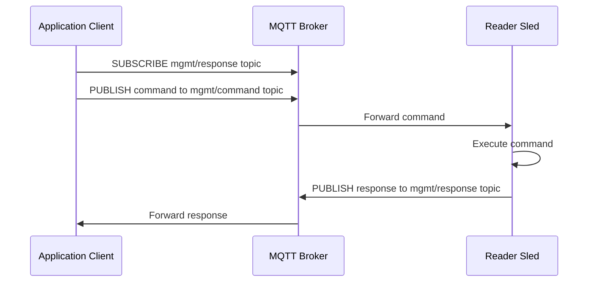
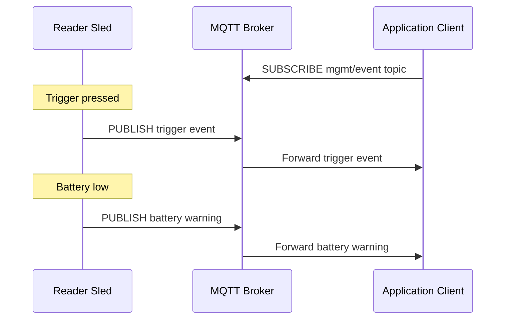
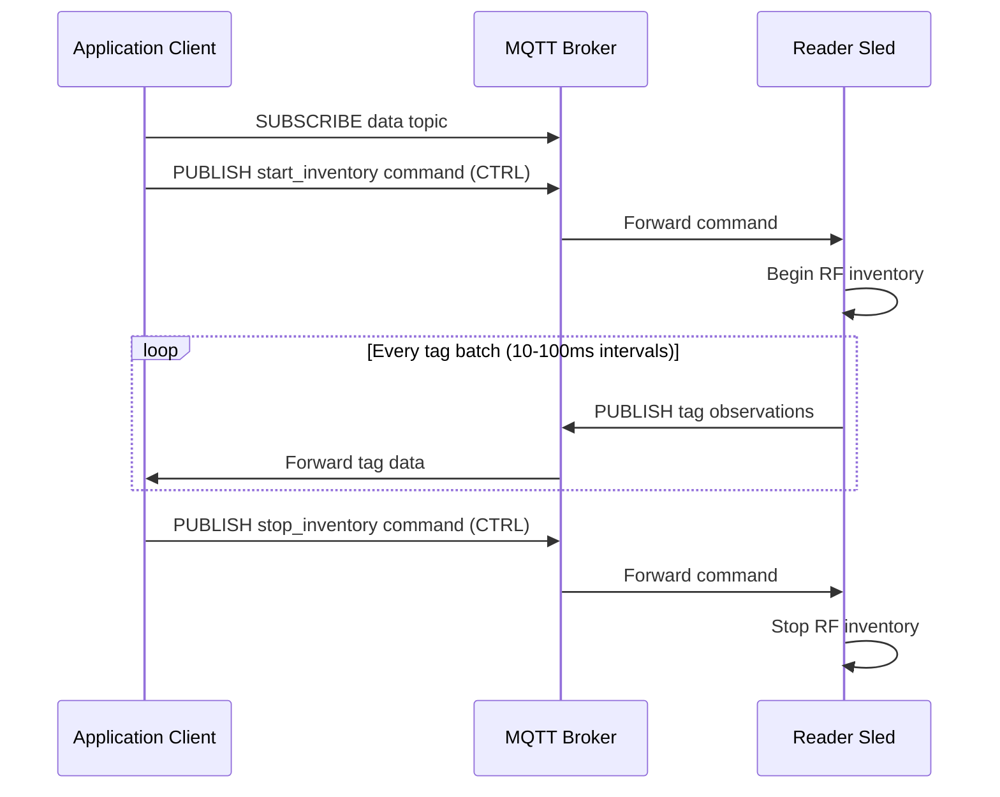

# About Communication Flow

<span className="badge badge--primary">📘 EXPLANATION</span>

## Overview

All IOTC communication follows the MQTT publish/subscribe model. There are three primary communication flows, each optimized for a different interaction pattern. Understanding these flows is critical for building responsive and reliable integrations.

## Flow 1: Command-Response

The command-response flow is used for synchronous-style interactions where the application sends a command and expects a reply. This flow is used by the **MGMT** and **CTRL** interfaces.

### Sequence



### How It Works

1. The application subscribes to the **response topic** for the target reader:
   ```
   {tenantId}/mgmt/clients/{channel}/{deviceSerial}/response
   ```

2. The application publishes a command to the **command topic**:
   ```
   {tenantId}/mgmt/clients/{channel}/{deviceSerial}/command
   ```

3. The reader receives the command, executes it, and publishes the result to the response topic.

4. The broker delivers the response to all subscribers of that response topic.

### Timing

- Typical round-trip time: 30–100 ms (Wi-Fi), 100–400 ms (cellular)
- The reader processes commands sequentially; a new command waits until the previous one completes
- If no response is received within 10 seconds, the application should consider the command timed out

### Example: Query Device Info

**Command** (published by application):
```json
{
  "command": "get_device_info",
  "requestId": "req-001"
}
```

**Response** (published by reader):
```json
{
  "command": "get_device_info",
  "requestId": "req-001",
  "status": "success",
  "data": {
    "model": "RFD40-PREMIUM",
    "serialNumber": "23044501500123",
    "firmwareVersion": "3.12.10",
    "iotcVersion": "1.1.0",
    "batteryLevel": 87
  }
}
```

## Flow 2: Event Streaming

The event streaming flow delivers asynchronous device events; state changes, trigger actions, Bluetooth connection events, and error conditions. Events are published by the reader without a preceding command.

### Sequence



### How It Works

1. The application subscribes to the **event topic** for the target reader (or uses a wildcard for all readers):
   ```
   {tenantId}/mgmt/clients/{channel}/{deviceSerial}/event
   ```

2. When a notable event occurs on the reader, the IOTC Agent publishes an event message to this topic.

3. Events are fire-and-forget from the reader's perspective; there is no acknowledgment mechanism.

### Event Types

| Event | Trigger | QoS |
|-------|---------|-----|
| `trigger_pressed` | Physical trigger button pulled | QoS 0 |
| `trigger_released` | Physical trigger button released | QoS 0 |
| `bluetooth_connected` | Reader paired with host device | QoS 1 |
| `bluetooth_disconnected` | Bluetooth link lost | QoS 1 |
| `battery_warning` | Battery level drops below 20% | QoS 1 |
| `battery_critical` | Battery level drops below 5% | QoS 1 |
| `temperature_warning` | Reader temperature exceeds 55°C | QoS 1 |
| `antenna_fault` | Antenna impedance mismatch detected | QoS 1 |
| `error` | General error condition | QoS 1 |

## Flow 3: Tag Data Streaming

The tag data streaming flow is the highest-volume communication path. During an active inventory operation, the reader continuously publishes tag observations to the **DATA** interface.

### Sequence



### How It Works

1. The application subscribes to the **data topic**:
   ```
   {tenantId}/data/clients/{channel}/{deviceSerial}
   ```

2. The application sends a `start_inventory` command via the **CTRL** interface.

3. The reader begins inventory rounds and publishes batches of tag observations to the data topic.

4. Tag data is published at a configurable interval (default: 100 ms batches). Each message may contain 1–50 tag observations.

5. The application sends a `stop_inventory` command to end the stream.

### Tag Data Payload

Each tag observation in the data stream contains:

```json
{
  "tags": [
    {
      "epc": "E280116060000209A3C91452",
      "rssi": -45.5,
      "antennaPort": 0,
      "timestamp": "2026-05-14T10:30:15.123Z",
      "phaseAngle": 127.3,
      "channelIndex": 12,
      "readCount": 3,
      "tid": "E2801190200050584C941001"
    }
  ],
  "batchId": 42,
  "readerSerial": "23044501500123"
}
```

### Volume Considerations

| Scenario | Tag Population | Messages/sec | Bandwidth |
|----------|---------------|-------------|-----------|
| Sparse (retail shelf) | 10–50 tags | 5–10 | 2–5 KB/s |
| Medium (warehouse pallet) | 50–200 tags | 20–50 | 10–25 KB/s |
| Dense (conveyor belt) | 200–1,000 tags | 50–200 | 25–100 KB/s |

Post-filters (unique tag interval, RSSI threshold) can significantly reduce message volume in dense environments.
