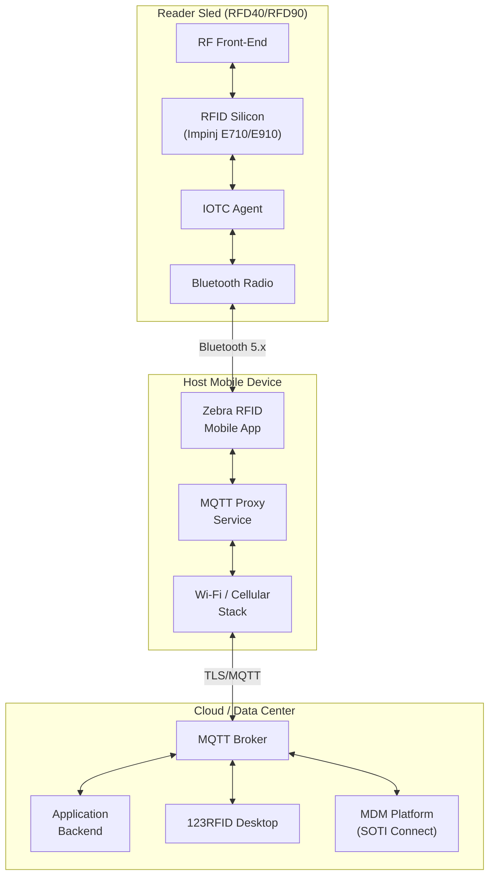

# About Component Architecture

📘 EXPLANATION

## Overview

The IOTC ecosystem comprises several interacting components, each with a distinct role. Understanding these components and their boundaries helps you design integrations that are maintainable, scalable, and resilient.

## Component Diagram

## Component Details

### IOTC Agent (Reader Firmware)

The IOTC Agent is a software module embedded in the reader sled's firmware. It is the core component that bridges the RFID hardware with the MQTT communication layer.

**Responsibilities:**
- Translate MQTT commands into RFID silicon register operations
- Execute inventory rounds, tag reads, and tag writes
- Serialize tag observations into JSON payloads
- Manage MQTT connection state, subscriptions, and message queuing
- Apply post-filters to tag data before transmission
- Report device health, battery status, and error conditions
- Persist configuration across reboots

**Implementation details:**
- Runs on the reader's embedded ARM processor
- Shares CPU resources with the Bluetooth stack and RF control firmware
- Maintains an internal message queue for outbound MQTT messages (up to 1,000 messages when disconnected)
- Supports up to 5 concurrent MQTT subscriptions

### MQTT Proxy Service (Host Device)

The host mobile device runs a proxy service that bridges the Bluetooth connection to the reader with the network-facing MQTT connection to the broker. This proxy is transparent; it does not inspect or modify MQTT payloads.

**Responsibilities:**
- Maintain the Bluetooth SPP (Serial Port Profile) or BLE GATT connection to the reader
- Establish and maintain the TCP/TLS connection to the MQTT broker
- Forward MQTT packets bidirectionally between Bluetooth and network
- Handle Bluetooth reconnection after signal loss
- Buffer messages during brief network interruptions

**Key behavior:**
- The proxy runs as an Android background service, surviving app switches and screen-off events
- Bluetooth disconnection triggers an automatic reconnection attempt for up to 30 seconds
- If the Wi-Fi/cellular connection drops, the proxy queues outbound messages (up to 500 KB) until connectivity is restored

### MQTT Broker

The broker is the central routing hub for all IOTC communication. It receives published messages and distributes them to subscribers based on topic matching rules.

**Requirements for IOTC compatibility:**
- MQTT 3.1.1 protocol support (mandatory)
- Support for QoS 0 and QoS 1 message delivery
- Retained message support
- Last Will and Testament (LWT) support
- Minimum 1,000 concurrent connections for fleet deployments
- TLS 1.2+ for production deployments

**Scaling considerations:**
- A single reader at full read rate generates approximately 50–200 MQTT messages per second
- Each message is 200–500 bytes of JSON payload
- For 100-reader fleets, plan for 5,000–20,000 messages per second at the broker

### 123RFID Desktop

Zebra's desktop application for reader configuration and diagnostics. It connects to the same MQTT broker as your application and provides a GUI for:

- Viewing real-time reader status and tag reads
- Configuring RF parameters (power, frequency, session)
- Updating reader firmware
- Running diagnostic tests (antenna check, temperature monitoring)
- Exporting tag data to CSV/Excel

123RFID Desktop is primarily used during development and commissioning. It can run alongside your application, both connect to the broker as independent MQTT clients.

### MDM Platform (SOTI Connect)

Enterprise Mobile Device Management platforms provide fleet-wide device lifecycle management. SOTI Connect is the primary MDM platform supported by IOTC.

**MDM capabilities for IOTC readers:**
- **Device enrollment**: automatic registration of new readers with the IOTC platform
- **Configuration profiles**: push standardized configurations to groups of readers
- **Firmware management**: schedule and deploy firmware updates across the fleet
- **Compliance monitoring**: verify readers meet security and configuration policies
- **Remote actions**: reboot, factory reset, or lock readers remotely

The MDM platform communicates with readers through the `mdm` topic segment, which is separate from the application's `mgmt`, `ctrl`, and `data` topics.

## Component Interaction Patterns

| Pattern | Components Involved | Description |
|---------|-------------------|-------------|
| **Command → Response** | App → Broker → Reader → Broker → App | Application sends a command; reader executes and returns a response |
| **Data Streaming** | Reader → Broker → App | Reader continuously publishes tag reads to the application |
| **Health Telemetry** | Reader → Broker → App | Reader periodically publishes device status and metrics |
| **Firmware Update** | MDM → Broker → Reader | MDM initiates firmware download and installation |
| **Configuration Push** | App → Broker → Reader | Application publishes new configuration parameters to the reader |
