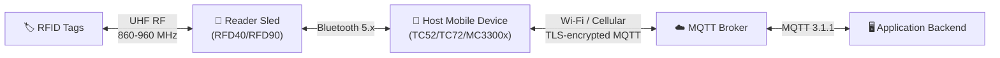

# About the End-to-End System

📘 EXPLANATION

## Overview

The Zebra IoT Connector for Handheld RFID operates within a multi-layered system that spans from physical RFID tags in the field to cloud-based application backends. Understanding the end-to-end data path is essential for designing reliable, performant integrations.

## System Architecture Diagram

## Layer-by-Layer Breakdown

### Layer 1: RFID Tags

Passive UHF RFID tags affixed to assets, inventory items, or containers. Tags have no battery; they harvest energy from the reader's RF signal to power their response. Each tag stores a unique EPC (Electronic Product Code) and may contain additional data in user memory.

**Key characteristics:**
- No power source required (passive)
- Read range depends on tag size, orientation, and environment (typically 1–10 m)
- Can store 96–496 bits of EPC data
- Respond to EPC Gen2 V2 air interface commands

### Layer 2: Reader Sled (RFD40 / RFD90)

The handheld RFID reader sled contains the RF front-end, antenna, RFID silicon, and the embedded IOTC Agent firmware. It performs tag singulation, reads EPCs and supplementary memory, and packages observations into structured JSON payloads.

**Key characteristics:**
- Single integrated antenna with configurable RF power (0–30 dBm)
- Runs the IOTC Agent firmware that implements MQTT protocol handling
- Connects to the host device via Bluetooth 5.x
- Battery-powered with power management states
- Physical trigger button for operator-initiated reads

### Layer 3: Host Mobile Device

A Zebra Android mobile computer paired to the reader sled via Bluetooth. The host serves as a **network gateway**; it receives MQTT packets from the reader over Bluetooth and forwards them to the MQTT broker over Wi-Fi or cellular.

**Key characteristics:**
- Runs the Zebra RFID Mobile App or a custom application using the Zebra RFID SDK
- Provides Wi-Fi (802.11ac/ax) or cellular (4G/5G) connectivity
- Handles TLS termination for the MQTT connection
- May run additional business logic or UI for the operator
- Responsible for Bluetooth pairing and connection management

### Layer 4: Network Transport

The MQTT traffic traverses the enterprise Wi-Fi network or cellular data connection from the host device to the MQTT broker. This layer is transparent to IOTC but critical for reliability.

**Key considerations:**
- Latency: Wi-Fi typically provides 5–20 ms to the broker; cellular can be 30–200 ms
- Bandwidth: Tag data streams at high read rates (500+ tags/second) can generate 100+ KB/s of JSON payload
- Reliability: Wi-Fi roaming and cellular handoffs can cause brief connection interruptions
- Security: All traffic should use TLS 1.2 or 1.3 encryption

### Layer 5: MQTT Broker

The central message routing component. The broker receives published messages from readers (via their host devices) and forwards them to subscribing application clients based on topic matching.

**Supported brokers include:**
- **HiveMQ** (recommended for enterprise deployments)
- **Eclipse Mosquitto** (open-source, suitable for development and small deployments)
- **AWS IoT Core** (managed MQTT service)
- **Azure IoT Hub** (managed MQTT service with device registry)
- **EMQX** (high-performance distributed broker)

### Layer 6: Application Backend

Your software system that subscribes to IOTC MQTT topics and processes tag data, device telemetry, and event notifications. The application also publishes commands to configure and control readers.

**Typical responsibilities:**
- Subscribe to DATA topics to ingest tag observations
- Subscribe to MGMT response topics to receive device status and configuration acknowledgments
- Publish commands to MGMT and CTRL topics to configure and control readers
- Store tag data in a database for inventory tracking, asset management, or analytics
- Implement business logic (alerts, dashboards, reports, integrations)

## Data Flow Summary

| Direction | Path | Content |
|-----------|------|---------|
| **Inbound** (tags → app) | Tag → Reader → BT → Host → Wi-Fi → Broker → App | EPC reads, RSSI, timestamps, tag memory data |
| **Outbound** (app → reader) | App → Broker → Wi-Fi → Host → BT → Reader | Configuration commands, inventory start/stop, RF power settings |
| **Telemetry** (reader → app) | Reader → BT → Host → Wi-Fi → Broker → App | Battery level, temperature, connection state, read statistics |
| **Events** (reader → app) | Reader → BT → Host → Wi-Fi → Broker → App | Trigger press/release, Bluetooth connect/disconnect, error conditions |

## Latency Expectations

Under typical conditions with Wi-Fi connectivity and a local or regional MQTT broker:

| Segment | Typical Latency |
|---------|----------------|
| RF tag response | < 1 ms |
| Bluetooth transit | 5–15 ms |
| Wi-Fi to broker | 5–20 ms |
| Broker routing | 1–5 ms |
| **End-to-end (tag read → app delivery)** | **15–50 ms** |

Cellular connectivity adds 20–150 ms to the network transit segment.
