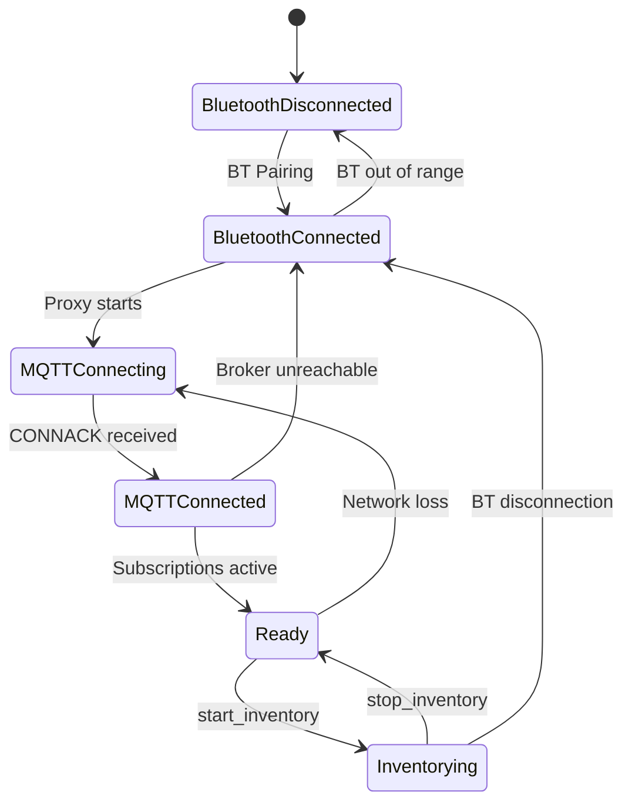

# About Handheld-Specific Architecture Considerations

📘 EXPLANATION

## Overview

Handheld RFID reader sleds introduce architectural constraints and design considerations that do not apply to fixed, rack-mounted RFID readers. These constraints stem from the battery-powered operation, Bluetooth-mediated connectivity, single-antenna form factor, and the human-operated nature of handheld devices. This page documents these considerations and their implications for system design.

## Bluetooth Dependency

Unlike fixed readers that connect directly to the network via Ethernet or Wi-Fi, handheld reader sleds depend entirely on a Bluetooth connection to a host mobile device for network access.

### Implications

- **Indirect connectivity**: The MQTT connection to the broker is established by the host device, not the reader itself. The reader communicates MQTT protocol data over Bluetooth to the host, which forwards it over Wi-Fi or cellular.
- **Range limitation**: The reader must remain within Bluetooth range (typically 10–30 m) of the host device. Moving out of range interrupts the MQTT connection.
- **Reconnection latency**: When Bluetooth reconnects after a brief disconnection, the MQTT session must be re-established. This introduces a 2–5 second delay before the reader is fully operational.
- **Pairing requirement**: Each reader must be paired with a specific host device. A reader cannot seamlessly roam between host devices without explicit re-pairing.

### Design Recommendations

- Implement connection state monitoring on your application to detect reader offline/online transitions
- Use MQTT Last Will and Testament (LWT) messages to detect unexpected disconnections
- Design inventory workflows to tolerate brief (5–30 second) connectivity gaps
- Consider queuing commands during disconnection and replaying them upon reconnection

## Battery Power Constraints

Handheld readers operate on rechargeable lithium-ion batteries with limited capacity (3,000–3,600 mAh). Every design decision affects battery life.

### Power Consumption by Activity

| Activity | Approximate Power Draw | Battery Impact |
|----------|----------------------|----------------|
| Idle (Bluetooth connected, no RF) | ~50 mW | 20+ hours standby |
| Active inventory (full RF power) | ~3,500 mW | 4–6 hours continuous |
| MQTT keep-alive (idle) | ~10 mW | Minimal impact |
| Bluetooth data transfer | ~100 mW | Moderate during streaming |

### Design Recommendations

- Use the `STANDBY` operating mode when the reader is not actively needed; this suspends RF activity and reduces Bluetooth communication
- Configure appropriate keep-alive intervals (60–120 seconds) to balance connection persistence with power savings
- Use post-filters to reduce the volume of tag data transmitted over Bluetooth, saving both radio power and processing energy
- Implement trigger-linked inventory (V1.1) so the reader only activates RF when the operator pulls the trigger
- Monitor battery telemetry and alert operators when battery level drops below 20%

## Single Antenna Architecture

Handheld readers have a single integrated antenna, unlike fixed readers that may have 4–32 antenna ports. This simplifies some aspects of the integration but limits others.

### Implications

- **Antenna port is always `0`**: Configuration commands that reference antenna ports always use port 0
- **No spatial multiplexing**: You cannot read from multiple zones simultaneously (as you would with a fixed reader's multiple antenna ports)
- **Orientation-dependent reads**: The read zone shape depends on how the operator holds and aims the reader
- **Consistent RF configuration**: Only one set of antenna parameters (power, frequency band) needs to be managed

### Design Recommendations

- Do not implement antenna-port cycling logic that would be appropriate for fixed readers
- Guide operators on optimal reader orientation for the target use case (pointing at tags vs. sweeping across a shelf)
- Use RSSI thresholds to filter out tags that are too far from the reader's primary read zone

## Host Device as Network Gateway

The host mobile device serves dual roles: it is both the operator's interface (running the mobile application) and the reader's network gateway (proxying MQTT traffic).

### Implications

- **Shared bandwidth**: The host device's Wi-Fi or cellular connection carries both MQTT traffic and any other application data (ERP queries, API calls, image uploads)
- **Application lifecycle**: If the Zebra RFID Mobile App or the MQTT proxy service is killed by Android's memory management, the reader loses its network connection
- **Network transitions**: When the host device roams between Wi-Fi access points or switches between Wi-Fi and cellular, the MQTT connection may be interrupted
- **Single point of failure**: If the host device's battery dies, is powered off, or crashes, the reader becomes disconnected

### Design Recommendations

- Ensure the MQTT proxy service is configured as a foreground Android service with a persistent notification to prevent the OS from killing it
- Test behavior during Wi-Fi-to-cellular handoffs and implement reconnection logic
- Size the host device's battery appropriately for the expected shift length
- Consider deploying spare host devices as backups

## Trigger Integration

Handheld readers have a physical trigger button that operators use to initiate tag reads. The trigger is a first-class input in the IOTC architecture.

### Trigger Modes

| Mode | Behavior | IOTC Version |
|------|----------|-------------|
| **Software-controlled** | Application sends `start_inventory` / `stop_inventory` commands | V1.0+ |
| **Trigger-linked** | Inventory starts on trigger pull, stops on trigger release, data streams automatically | V1.1+ |
| **Hybrid** | Trigger pull sends an event; application decides whether to start inventory | V1.0+ |

### Design Recommendations

- For operator-driven workflows (retail shelf scanning, asset finding), use trigger-linked mode (V1.1) for the most natural user experience
- For automated or timed workflows, use software-controlled mode
- Subscribe to trigger events (`trigger_pressed`, `trigger_released`) for UI feedback and workflow coordination

## Connection State Machine

The handheld reader's connectivity state is more complex than a fixed reader due to the Bluetooth intermediary:

Applications should track this state machine and adjust their behavior at each state. For example, queuing commands when the reader is in `BluetoothConnected` but not yet `MQTTConnected`, or displaying a reconnection indicator in the UI.
