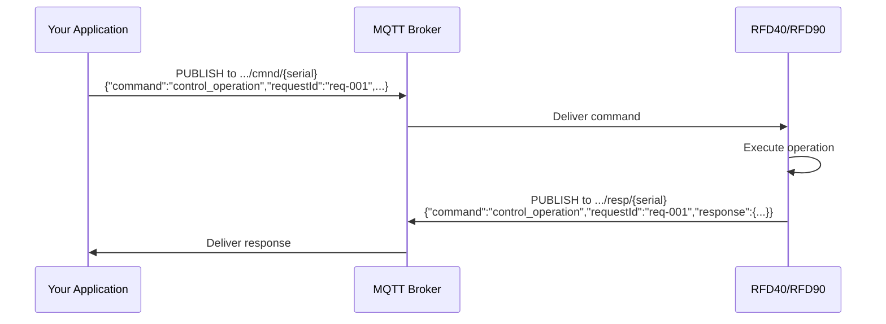
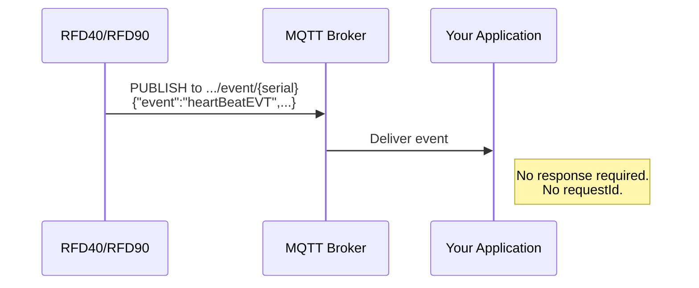

# MQTT for RFID: Core Concepts

Chapter 2 described the system architecture: four components connected by an MQTT broker. This chapter explains how the MQTT layer actually works; the topic hierarchy, the message patterns, the quality-of-service trade-offs, and the JSON payload conventions that every command and event follows.

If you are already fluent in MQTT, start at Section 3.2 where Zebra-specific design decisions begin. Section 3.1 exists as a self-contained primer for readers who need a refresher.

---

## 3.1 MQTT in 5 Minutes

### Publish/Subscribe vs. Request/Response

MQTT is a **publish/subscribe** messaging protocol. Unlike HTTP: where a client sends a request to a server and waits for a response; MQTT decouples senders from receivers through a **broker**:

- A **publisher** sends a message to a named **topic** on the broker.
- A **subscriber** that has registered interest in that topic receives the message.
- The publisher does not know who subscribes. The subscriber does not know who published. The broker handles routing.

This decoupling is fundamental to how Zebra RFID Connect works. Your application publishes a command to a topic. The reader (subscribed to that topic) receives it, executes it, and publishes a response to a different topic. Your application (subscribed to the response topic) receives the result. The broker makes the connection; neither side needs the other's IP address, open ports, or direct network path.

Zebra RFID Connect layers a **request/response pattern** on top of pub/sub. Every command includes a `requestId` field that the reader echoes in its response, allowing your application to correlate responses to commands, even when multiple commands are in flight concurrently.

### Topics, QoS Levels, and Retained Messages

Three MQTT concepts appear throughout this documentation:

**Topics** are hierarchical strings that name a message channel. They use `/` as a level separator. Example: `zebra/MGMT/clients/cmnd/RFD40-12345678`. Publishers send to a topic; subscribers filter by topic. MQTT topic names are **case-sensitive**.

**QoS (Quality of Service) levels** control delivery guarantees between the client and the broker:

| Level | Name | Guarantee | Trade-off |
|-------|------|-----------|-----------|
| **0** | At most once | Fire and forget. No acknowledgment. | Lowest latency and overhead. Message may be lost. |
| **1** | At least once | Broker acknowledges receipt. Retransmits if no ACK. | Message is guaranteed to arrive, but may arrive more than once. |
| **2** | Exactly once | Four-step handshake ensures single delivery. | Highest reliability. Highest latency and overhead. |

**Retained messages** are a broker feature. When a message is published with the **retain flag** set, the broker stores the most recent message on that topic. Any client that subscribes to the topic later receives the stored message immediately, without waiting for the next publish. Zebra RFID Connect uses retained messages on the `rfid` channel to provide late-subscribing clients with the most recent tag data snapshot.

### Why MQTT for IoT (vs. REST, WebSockets, gRPC)

MQTT was chosen as the transport protocol for Zebra RFID Connect for specific, first-principles reasons:

| Concern | MQTT | REST (HTTP) | WebSockets | gRPC |
|---------|------|-------------|------------|------|
| **Connection model** | Persistent TCP connection. Once connected, both sides can send at any time. | Stateless request/response. Each call opens a new connection (or reuses via keepalive). | Persistent, but no built-in pub/sub or QoS. | Persistent HTTP/2 streams. |
| **Push from device** | Native. The reader publishes events and tag data at any time. No polling. | Requires the server to poll the device, or the device to call a webhook. Neither is practical for a battery-powered reader behind NAT. | Possible, but requires custom framing and no delivery guarantee. | Server-streaming works, but requires the reader to run a gRPC server or maintain a bidirectional stream. |
| **Power efficiency** | Low. Small packet headers (2 bytes minimum). Keepalive pings sustain the connection at minimal cost. | High. HTTP headers add kilobytes of overhead per request. TLS renegotiation on each connection adds CPU cost. | Moderate. Websocket frames are small, but no built-in keepalive optimization. | Moderate. HTTP/2 framing is efficient, but Protobuf serialization adds CPU cost on constrained devices. |
| **Fleet-scale routing** | Built-in. Wildcard subscriptions let one application instance receive data from every reader. | Requires a load balancer, API gateway, or custom fan-out. | Requires custom routing logic. | Requires a service mesh or custom routing. |
| **Offline resilience** | The broker queues messages for disconnected clients (with persistent sessions and QoS ≥ 1). | No native offline support. | No native offline support. | No native offline support. |

The battery-powered, Wi-Fi-connected, NAT-traversing nature of a handheld RFID reader makes MQTT the strongest fit. The reader maintains a single persistent connection to the broker. Commands arrive instantly without polling. Tag data and events stream out without the reader needing a routable IP address or an open inbound port.

---

## 3.2 Topic Hierarchy Design

For the complete topic reference including wildcard subscription patterns and per-interface examples, see [MQTT Topic Reference](/handheld/architecture/mqtt-topics).

### The Five-Level Topic Pattern

Every MQTT topic in Zebra RFID Connect follows a single five-level pattern:

```
{tenantId}/{interface}/clients/{channel}/{deviceSerial}
```

| Level | Segment | Description | Example Values |
|-------|---------|-------------|----------------|
| 1 | `{tenantId}` | Tenant or organization identifier. Set when configuring the MQTT endpoint via `config_endpoint`. | `zebra`, `acme-corp`, `wh-east` |
| 2 | `{interface}` | MQTT interface. Determines which command domain is addressed. Always UPPERCASE. | `MGMT`, `CTRL`, `DATA`, `MDM` |
| 3 | `clients` | Fixed literal. Namespace segment present in every topic. | `clients` |
| 4 | `{channel}` | Message direction or data type. Determines what kind of message the topic carries. | `cmnd`, `resp`, `event`, `data1event`, `data2event`, `rfid` |
| 5 | `{deviceSerial}` | Unique reader serial number. Matches the `deviceSerialNo` field returned by `get_version`. | `RFD40-212735201D0053` |

**Concrete example: sending a command and receiving a response:**

```
Publish command:    zebra/CTRL/clients/cmnd/RFD40-212735201D0053
Subscribe response: zebra/CTRL/clients/resp/RFD40-212735201D0053
```

---

## 3.3 Message Patterns

The API uses three distinct message patterns. Understanding which pattern each topic follows prevents common integration errors; such as expecting a response to an event, or sending a command on a response topic.

### Command/Response (Bidirectional)

Used by all 22 commands on the MGMT, CTRL, and MDM interfaces.



**How it works:**

1. Your application publishes a JSON command to the `cmnd` topic.
2. The broker delivers it to the reader (which is subscribed to `cmnd`).
3. The reader executes the command and publishes a JSON response to the `resp` topic.
4. The broker delivers the response to your application (which is subscribed to `resp`).

**Correlation:** Every command includes a `requestId` field (a string you generate). The reader echoes the same `requestId` in the response. This allows your application to match responses to commands, even when multiple commands are in flight simultaneously. Use UUIDs or monotonic counters; the reader does not inspect the value.

**Concurrency:** The reader processes commands sequentially on each interface. If you publish two MGMT commands in rapid succession, the reader processes the first and responds before processing the second. CTRL commands are processed on a separate connection and do not queue behind MGMT commands.

### Fire-and-Forget Events (Unidirectional)

Used by all 6 events: `heartBeatEVT`, `alerts`, `alert_short`, `exceptionEVT`, `mqttConnEVT` (on the `event` channel), and `dataEVT` (on `data1event` / `data2event`).



**How it works:**

1. The reader detects a condition (periodic timer, threshold exceeded, state change, tag read).
2. The reader publishes an event payload to the appropriate topic.
3. The broker delivers it to all subscribers.
4. **No response is expected or sent.** Events are unidirectional.

Events use the `event` field (not `command`) in their JSON envelope, and they do not include a `requestId`. Your application cannot "reply" to an event; it only consumes them.

**When events fire:**

| Event | Trigger |
|-------|---------|
| `heartBeatEVT` | Periodic timer (configurable interval via `config_events`) |
| `alerts` | Threshold exceeded: temperature, battery level, battery health |
| `alert_short` | Same triggers as `alerts`, compact format for MDM consumption |
| `exceptionEVT` | Runtime error: radio, scanner, system, or network failure |
| `mqttConnEVT` | MQTT broker connection state change (connected, disconnected, reconnecting) |
| `dataEVT` | Each tag read cycle during active RFID inventory |

### Retained Data (Late-Subscriber Pattern)

Used on the `rfid` channel.

```
zebra/DATA/clients/rfid/{deviceSerial}
```

The reader publishes the most recent tag data or RFID state to this topic with the MQTT **retain flag** set to `true`. The broker stores this message. When a new client subscribes to this topic, even minutes or hours after the last publish; the broker immediately delivers the stored message.

**When to use it:** Applications that need the reader's last-known RFID state at startup, without waiting for the next inventory cycle or heartbeat. Dashboards, monitoring tools, and late-joining fleet managers benefit from this pattern.

**Difference from `data1event`:** The `data1event` channel delivers real-time tag reads during active inventory. Messages are transient, if no subscriber is connected, they are lost (at QoS 0) or queued briefly (at QoS 1). The `rfid` channel provides persistent availability of the most recent snapshot.

---

## 3.4 Quality of Service Guidance

MQTT QoS levels control the delivery guarantee between a client and the broker. Choosing the right QoS for each traffic type balances reliability against throughput, latency, and battery consumption.

### QoS 0: At Most Once

| Aspect | Detail |
|--------|--------|
| **Guarantee** | None. The sender publishes and moves on. No acknowledgment. |
| **Use in Zebra RFID Connect** | Tag data (`dataEVT`) in high-throughput scenarios. |
| **Why it works for tag data** | During a dense inventory, the reader produces hundreds of tag reads per second. Each tag will be read again on the next cycle. Losing an occasional `dataEVT` message does not cause data loss; it causes a temporary delay until the tag is read again. QoS 0 eliminates the per-message ACK overhead, reducing broker load and radio power consumption. |
| **When to avoid** | When every tag read must be captured on the first pass (e.g., a conveyor belt where each tag passes the reader exactly once). Use QoS 1 instead. |

### QoS 1: At Least Once

| Aspect | Detail |
|--------|--------|
| **Guarantee** | The broker acknowledges receipt. If no ACK is received, the sender retransmits. The message is guaranteed to arrive, but may arrive more than once. |
| **Use in Zebra RFID Connect** | Commands (`cmnd`), responses (`resp`), and all events (`event`, `data1event` in critical scenarios). This is the **default and recommended QoS** for most traffic. |
| **Why it works for commands** | A lost `set_operating_mode` command means the reader never changes its configuration. The operator assumes the change was applied, but it wasn't. QoS 1 prevents this. The trade-off; potential duplicate delivery; is handled by the reader idempotently (sending the same configuration twice has the same effect as sending it once). |
| **Handling duplicates** | Your application should tolerate duplicate responses. The `requestId` field allows deduplication: if you receive two responses with the same `requestId`, discard the second. |

### QoS 2: Exactly Once

| Aspect | Detail |
|--------|--------|
| **Guarantee** | Four-step handshake (PUBLISH → PUBREC → PUBREL → PUBCOMP) ensures exactly one delivery. |
| **Use in Zebra RFID Connect** | Not recommended for standard operations. |
| **Why it's rarely needed** | The four-step handshake doubles the round trips compared to QoS 1, increasing latency and battery drain on the reader. Commands are already idempotent (safe to receive twice), and events are informational (a duplicate heartbeat is harmless). The reliability benefit of QoS 2 over QoS 1 does not justify the cost for this API. |
| **When to consider** | Only if your broker or regulatory environment requires exactly-once semantics and you cannot implement application-level deduplication. Some cloud IoT platforms (e.g., AWS IoT Core) do not support QoS 2 at all. |

### Summary

| Topic Type | Channel | Recommended QoS | Rationale |
|-----------|---------|-----------------|-----------|
| Commands | `cmnd` | **1** | Commands must arrive. Duplicates are idempotent. |
| Responses | `resp` | **1** | Responses must arrive. Deduplicate by `requestId`. |
| Events | `event` | **1** | Health and alert events must not be lost. |
| Tag data (high-throughput) | `data1event` | **0** | Prioritize throughput. Tags are re-read on next cycle. |
| Tag data (critical) | `data1event` | **1** | When every read matters (single-pass conveyors). |
| Retained data | `rfid` | **1** | Ensure the retained snapshot is stored. |

---

## 3.5 Payload Conventions

Every message in the Zebra RFID Connect API (commands, responses, and events) is a **JSON object** published as the MQTT payload. This section describes the envelope structure, response code semantics, and field naming conventions that apply across all 28 endpoints.

### JSON Envelope Structure

#### Command Envelope

Every command payload contains these top-level fields:

```json
{
  "command": "control_operation",
  "requestId": "req-001",
  "ctrlOprPayload": {
    "controlType": "RFID",
    "operation": "START"
  }
}
```

| Field | Type | Required | Description |
|-------|------|----------|-------------|
| `command` | string | **Yes** | The command name. Must exactly match the API command (e.g., `"set_wifi"`, `"get_status"`, `"reboot"`). |
| `requestId` | string | **Yes** | A unique identifier you generate. The reader echoes it in the response for correlation. No format requirement; UUIDs, counters, and opaque strings all work. |
| *payload object* | object | Conditional | Command-specific data. The field name varies by command (e.g., `ctrlOprPayload`, `cfgWifiPayload`, `endpointConfig`). Some commands (e.g., `get_status`, `reboot`) require no payload object, only `command` and `requestId`. |

#### Response Envelope

Every response payload contains these top-level fields:

```json
{
  "command": "control_operation",
  "requestId": "req-001",
  "apiVersion": "V1.1",
  "response": {
    "code": 0,
    "description": "Success"
  }
}
```

| Field | Type | Always Present | Description |
|-------|------|----------------|-------------|
| `command` | string | Yes | Echoes the command name from the request. |
| `requestId` | string | Yes | Echoes the `requestId` from the request. |
| `apiVersion` | string | Yes | The API version the reader is running (e.g., `"V1.1"`). |
| `response` | object | Yes | Contains `code` (integer) and `description` (string). |
| *data object* | object | Conditional | Command-specific response data (e.g., `deviceStatus`, `deviceVersion`, `wifiConfig`). Present only when the command returns data and the response code is `0` (success). |

#### Event Envelope

Events use `event` instead of `command`, and do not include `requestId`:

```json
{
  "event": "heartBeatEVT",
  "deviceSerial": "RFD40-212735201D0053",
  "timestamp": "2026-04-09T14:30:00.000Z",
  "apiVersion": "V1.1",
  "heartbeat": {
    "uptimeSeconds": 86400,
    "temperature": 32
  }
}
```

| Field | Type | Always Present | Description |
|-------|------|----------------|-------------|
| `event` | string | Yes | The event type identifier (e.g., `"heartBeatEVT"`, `"alerts"`, `"dataEVT"`). |
| `deviceSerial` | string | Yes | Serial number of the reader that generated the event. |
| `timestamp` | string | Yes | ISO 8601 timestamp of the event. |
| `apiVersion` | string | Yes | API version. |
| *event data* | object | Yes | Event-specific payload. Field name matches the event type (e.g., `heartbeat`, `tagData`, `alert`). |

### Response Code Semantics

The `response.code` field is an integer. A value of `0` means success. Any non-zero value indicates an error or an asynchronous acceptance.

| Range | Category | Meaning |
|-------|----------|---------|
| `0` | **Success** | Command executed. Response includes result data (if applicable). |
| `1` | **Accepted** | Command accepted for asynchronous processing. The final result will follow in a subsequent response or event. |
| `2–5` | **Input errors** | Payload validation failed: malformed JSON, missing fields, unsupported values. Fix the payload and retry. |
| `6–9` | **Precondition errors** | The device state does not permit the operation. Example: `6` = region not configured, must be set via 123RFID Desktop. |
| `10–14` | **Configuration conflicts** | A resource already exists (`10`) or does not exist (`11`). Use the corresponding getter to verify state before retrying. |
| `15–18` | **Resource errors** | A referenced resource (SSID, certificate) was not found or could not be parsed. |
| `19–21` | **Firmware errors** | Firmware download failed, validation failed, or insufficient battery for update. |
| `22–28` | **Operational errors** | A conflicting operation is in progress, the radio is not connected, or the requested feature is unsupported on the current firmware. |

The `response.description` field provides a human-readable explanation. Always match on `code` (integer), not `description` (string); the description text may change between firmware versions.

> **See also:** [Appendix A: Response Codes Master Reference](/handheld/appendices) for the full table with per-command breakdowns, typical causes, and recommended recovery actions.

### Field Naming Conventions

All JSON fields across the API follow consistent naming rules:

- **camelCase**: All field names use lower camelCase: `requestId`, `controlType`, `deviceSerial`, `chargePercentage`. No snake_case, no PascalCase except in enum values.
- **Nested objects**: Related fields are grouped into named objects: `response.code`, `heartbeat.uptimeSeconds`, `batteryStatus.chargePercentage`. Nesting depth varies by complexity tier (T1 commands like `set_operating_mode` have 3–4 levels; T4 commands like `reboot` have 1 level).
- **Enum values as UPPER_SNAKE_CASE strings**: Enumerated values use uppercase with underscores: `"RFID"`, `"START"`, `"BALANCED_PERFORMANCE"`, `"WPA2_ENTERPRISE"`. This distinguishes enums from free-text fields visually.
- **Command names as snake_case strings**: The `command` and `event` fields use lowercase snake_case (with the exception of historical event names like `heartBeatEVT` and `dataEVT`, which use camelCase with an EVT suffix).
- **Booleans are explicit**: Boolean fields are named as adjectives or states: `tls`, `cleanSession`. They are not encoded as integer 0/1. Use JSON `true` / `false`.
- **Integers, not strings, for numeric values**: Numeric fields (`code`, `port`, `chargePercentage`, `uptimeSeconds`) are JSON integers, not quoted strings. Exception: `requestId` is a string even when it contains only digits, because it is a correlation token, not a numeric value.
